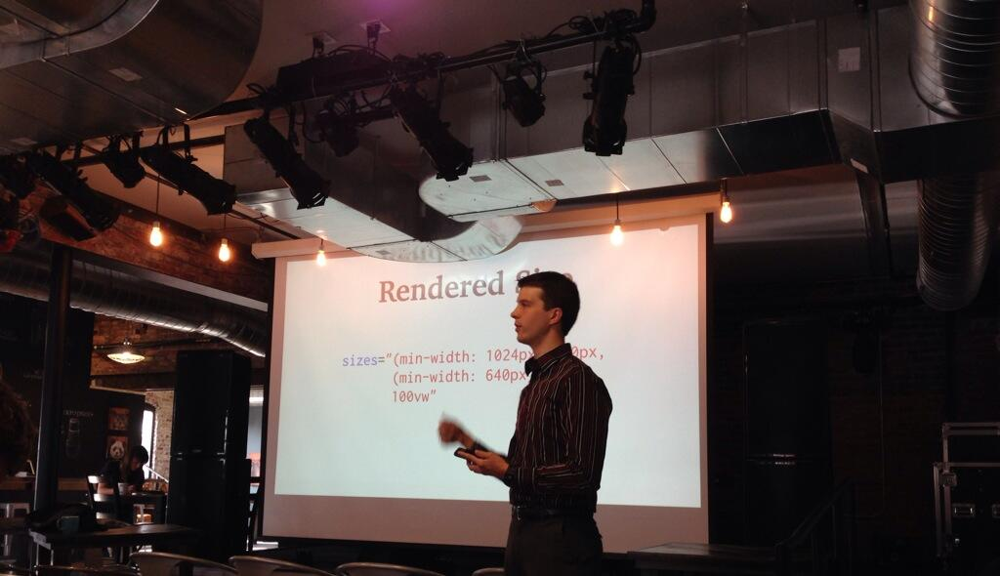

I spoke at [Omaha Coffee & Code](http://www.meetup.com/coffeeandcode/) about the work the [Responsive Images Community Group][respimg] has been up to lately:

> Big heavy images are responsible for most of the bloat on a responsive website, but it doesn't have to be that way. Here's the latest HTML elements you can use to keep your images small, and your site lean & fast.

## Slides

`speakerdeck:1cbf82f0e3b001311c6d56c19b776c40`

## Screencast

`vimeo: 99683665`

Thanks to Eric Portis's [amazing post on srcset/sizes][eric], which really helped me understand how these new elements worked, and from which I borrowed liberally.

Photo credit: [Rebecca Stavick](https://twitter.com/RebeccaStavick/status/483982587845541889)

[respimg]: http://responsiveimages.org/
[eric]: http://ericportis.com/posts/2014/srcset-sizes/
