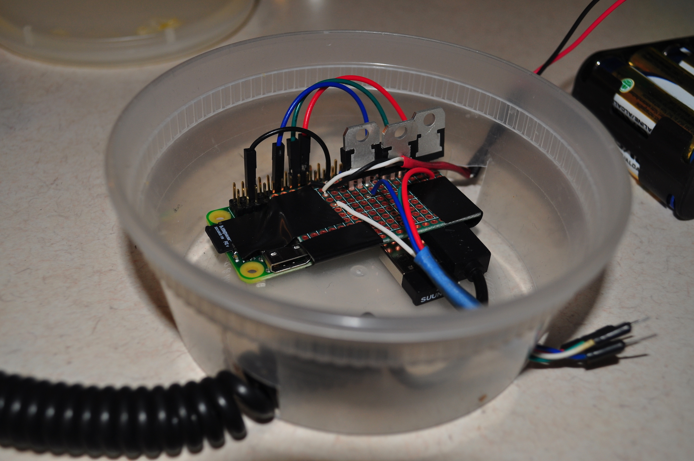

<blockquote class="instagram-media" data-instgrm-version="6" style=" background:#FFF; border:0; border-radius:3px; box-shadow:0 0 1px 0 rgba(0,0,0,0.5),0 1px 10px 0 rgba(0,0,0,0.15); margin: 1px; max-width:658px; padding:0; width:99.375%; width:-webkit-calc(100% - 2px); width:calc(100% - 2px);">
 
 

<a href="https://www.instagram.com/p/_K3TQNH-fK/" style=" color:#c9c8cd; font-family:Arial,sans-serif; font-size:14px; font-style:normal; font-weight:normal; line-height:17px; text-decoration:none;" target="_blank">A video posted by @mattdsteele</a> on <time style=" font-family:Arial,sans-serif; font-size:14px; line-height:17px;" datetime="2015-12-11T23:20:29+00:00">Dec 11, 2015 at 3:20pm PST</time>

</blockquote>

I recently partook in [Bike De'Lights][event], Omaha's two-wheeled tour of the Christmas lights on display in Midtown.
Cyclists are encouraged to decorate their bikes with battery-powered lights, jingle bells, and get into the festive spirit.

I treat this as an opportunity to build an overly-complex hardware project.
[Last year I wired up an Arduino][2014] to generate remote-control signals to drive an LED light strip.
It was fun, but there were some opportunities to make it better (or just further complect the system), which is what I did!

My goal for the project: hook up an LED light strip to my bike frame, and have it respond to my heart rate and pedaling cadence, using the ANT+ sensors on my bike.
Specifically, I wanted the lights to **change color from green to red as I pedaled faster**, and have the **lights blink in sync with my heart rate**.

I used a Raspberry Pi and an app written in JavaScript to do this. The code is on [GitHub][github]. It was rickety, but it worked! Here's how I put it together.

## Hardware

The core of the project:

- [Raspberry Pi Zero](https://www.raspberrypi.org/blog/raspberry-pi-zero/) and a 4GB micro SD card
- [5M Waterproof RGB LED Light Strip](https://www.amazon.com/gp/product/B00DTOAWZ2)
- [USB portable charger](https://www.amazon.com/Energizer-Portable-Smartphone-Charger-smartphones/dp/B0092MD8P6) and micro-USB cable

To power the LED light strip:

- [TIP120 Transistors (3x)](https://www.radioshack.com/products/tip120-transistor?variant=5717612869)
- [8 AA battery holder](https://www.radioshack.com/products/radioshack-8-aa-battery-holder?variant=5717214213) and [9V snap connector](https://www.radioshack.com/products/radioshack-heavy-duty-9v-snap-connectors?variant=5717208197)
- A handful of jumper wires and a prototyping board

To capture sensor input from the bike:

- [ANT+ USB receiver](https://www.amazon.com/gp/product/B004YJSD20)
- [Speed/Cadence Bike Sensor](https://www.amazon.com/Garmin-Speed-Cadence-Bike-Sensor/dp/B000BFNOT8)
- [Heart Rate Monitor](https://buy.garmin.com/en-US/US/shop-by-accessories/fitness-sensors/hrm-run-/prod133715.html)
- [Micro-USB to USB adapter](https://www.amazon.com/gp/product/B015XA3W0G) (the Pi Zero has micro-USB inputs)

I had most of these items on hand from previous projects, but had to buy the LED Light Strip and transistors.
In total this project uses less than \$20 of consumable parts.

Everything fit in my bike's saddle bag; this worked really well due to the super-tiny Pi Zero.
I placed the Pi and the circuit board in a makeshift enclosure I made from a to-go container, and held it down using electrical tape.

### Schematic

The circuit to power the LEDs is pretty straightforward:

The Pi sends PWM signals to the red/green/blue input wires, and the 12V of batteries goes to the LED light strip.

Also note: the dimensions are off in the diagram - the circuitboard was actually bigger than the Raspberry Pi Zero!

## Software

The Raspberry Pi was running [Raspbian](https://www.raspberrypi.org/downloads/raspbian/) and a program I wrote in Node.js.

I used Thomas Sarlandie's [pi-blaster](https://github.com/sarfata/pi-blaster) library to send PWM signals to the LED strip.
The library creates a `/dev/pi-blaster` endpoint on the filesystem, which you write to and it send the signals to the GPIO pins.
There's even a [Node.js wrapper](https://github.com/sarfata/pi-blaster.js) which made adding it to my app super simple.

`youtube:M45KM8725Os`

To capture ANT+ data, I used Alessandro Vergani's [ant-plus](https://github.com/Loghorn/ant-plus) library, which emits Node-style events when new sensor data comes in.
This worked well, but only the heart rate monitor was supported out of the box.
So the majority of the coding I did for the project was implementing the ANT+ speed/cadence sensor into the library.
The [pull request](https://github.com/Loghorn/ant-plus/pull/4) shows the fun involved there.

The actual code to integrate sensor input and have it drive the LEDs was another fun learning experience.
Since the heart rate and cadence sensors produced a stream of events, I pulled in [RxJS](https://github.com/Reactive-Extensions/RxJS) to treat them as Observables, and used reactive programming techniques to map the inputs into a stream that could "render" an LED strip.
That's probably another blog post in itself.

Once I had a working protytpe, I configured a `systemd` service to start the Node application when the Pi booted up.
This was especially useful as I had to reboot the Pi multiple times during the ride.

## Running the Lights

Overall, I'd say the results were a solid B/B+.
The lights were super bright, and lots of folks complemented them as I rode.
It was especially cool to see the lights start flashing like crazy as we climbed a big hill and my heart rate spiked.
But some parts could have worked better.

The cadence sensor connection was buggy as hell.
About 50% of the time it wouldn't connect to the sensor on startup.
I programmed the lights to fade to blue after 5 seconds any pedaling events, for times when I was coasting downhill or stopped.
But when the sensor didn't connect, the lights stayed blue until I could stop, reboot the Pi, and try it again.
I'm not sure why this happened.
My guess is it had to do with interference from other sensors, since the problem was especially pronounced at stops and locations with lots of other cyclists.

I would also have fastened everything down better.
Omaha streets are often potholed and bumpy, and there were several times when the batteries fell out of the enclosure, shutting all the lights off.
I also just used jumper wires to connect the circuit board to the LED strip, and those fell out a number of times.
A little more soldering and electrical tape would have fixed these issues.
A shakedown ride or two would have also helped; most of my testing was done on an indoor bike trainer.

Also, I would have have given myself more time to build it out.
I was working on the cadence sensor code until 4am the previous night, which probably contributed to the overall bugginess of the code.

But with those caveats in mind, I was happy with the result!
In particular I liked that I could use a Raspberry PI and write JavaScript code to power hardware, using tools I was already familiar with.
This solidifies my belief that [hardware is the new Geocities](/hardware-is-the-new-geocities), and that it's possible to build pretty slick (if a little rickety) physical projects using JavaScript.

## References

All the code I used is on [GitHub][github].
If you use this as the basis for your project, shoot me a note, I'd love to hear how it goes!

Other pages I found useful:

- [mitchtech.net/raspberry-pi-pwm-rgb-led-strip/](http://mitchtech.net/raspberry-pi-pwm-rgb-led-strip/)
- [willmakesthings.com/color-my-desk/](http://willmakesthings.com/color-my-desk/)
- [github.com/k1sul1/Raspberry-Pi-PHP-LED-controller](https://github.com/k1sul1/Raspberry-Pi-PHP-LED-controller#whatsneeded)
- [elfboimakingstuff.tumblr.com/](https://elfboimakingstuff.tumblr.com/post/132956410578/raspberry-pi-pwm-rgb-led-strip)

[event]: https://www.facebook.com/events/1093828353982844/
[2014]: /arduino-bike-lights/
[github]: https://github.com/mattdsteele/raspberry-pi-bike-leds
