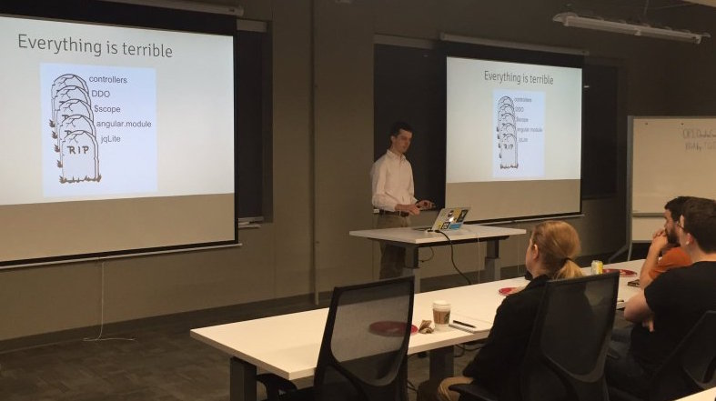

I spoke at [ng-nebraska](https://web.archive.org/web/20160501021547/http://www.ng-nebraska.com:80/) on how the ngUpgrade module can help bridge the gap between Angulars 1 and 2.

`vimeo: 164378615`

## [Demo App (upgraded to ng2)](http://projects.steele.blue/projects/superbowl-squares/)

## [Code on GitHub](https://github.com/mattdsteele/football-squares)

## Slides

`speakerdeck:3b01eb70e7154a33bbcefd10a6bf49d1`
