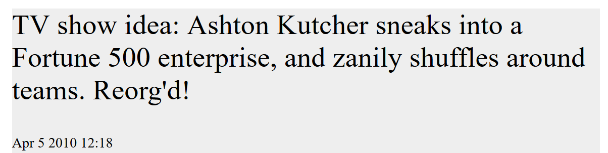
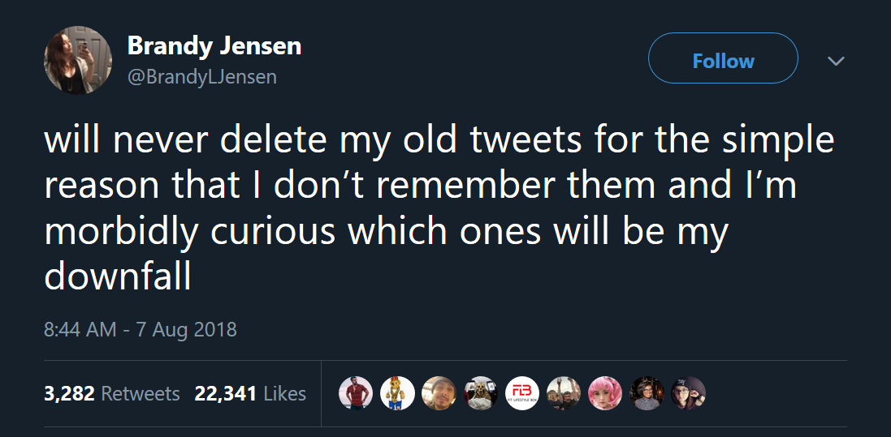

Or: why would I delete gold like this?

I've been on Twitter for eleven years and in that time amassed a trail of thousands of tweets. I couldn't tell you what 99% of them are about, because Twitter is meant to be ephemeral.
Unless you're [Milkshake Duck](https://twitter.com/pixelatedboat/status/741904787361300481).

Every week or two someone's old Twitter history gets weaponized against them. Sometimes it's [Ken Bone](https://web.archive.org/web/20180825061230/https://money.cnn.com/2016/10/14/technology/ken-bone-reddit/) or [Josh Hader](https://www.washingtonpost.com/news/the-intersect/wp/2018/07/18/josh-haders-all-star-game-controversy-shows-how-online-ghosts-will-haunt-us-forever/?utm_term=.4855f2e8eaa1)'s history cropping up after achieving minor Internet fame.

But more often it's the latest form of [oppo research](https://www.washingtonpost.com/news/the-intersect/wp/2018/07/30/theres-no-good-reason-to-keep-old-tweets-online-heres-how-to-delete-them/?utm_term=.6da146165ecb); wherein trolls like Mike Cernovich dig up old tweets, and use them in bad faith to smear their ideological opponents. Trevor Noah, Sarah Jeong, Patton Oswalt - all fell victim to this in the last year.

So yeah, I want Twitter to behave more like Snapchat or Instagram Stories.

Twitter will probably never provide this out of the box. So I built [Blumhouse](https://github.com/mattdsteele/blumhouse), an app that purges (get it?) old tweets from your timeline. Before the purge, it also archives them in a private database and generates a static website for your old takes to live out their lives in privacy.

# Turnkey Userland

There are a number of prebuilt tools to this problem. [TweetDelete](https://tweetdelete.net/) is a one-button approach that requires zero programming.
There are also self-hosted tools like [timeliner](https://github.com/mholt/timeliner) or [ephemeral](https://github.com/victoriadotdev/ephemeral) that provide archive or delete capabilities.

You can also [request an archive](https://web.archive.org/web/20190320025155/https://twitter.com/settings/your_twitter_data) of your data from Twitter, if you like messing with giant zips of XML.

But in true NIH fashion, none of them did exactly what I wanted so it became my latest side project. This also gave me an opportunity to play with Google's Cloud Platform, which recently announced [Serverless support for Go](https://cloud.google.com/blog/products/application-development/cloud-functions-go-1-11-is-now-a-supported-language), among other goodies.

But if you're cool with setting up Twitter API keys and a bit of cloud provisioning, feel free to run this yourself. Details are in the [README](https://github.com/mattdsteele/blumhouse#if-you-do-want-to-run-this-on-your-account).

# This really should be built-in

The system isn't perfect; my tweets are still in the Internet Archive, the Library of Congress, and probably a bunch of other systems. But at least folks would have to put in a little work to root around in the past.

Ideally Twitter would provide this feature. Maybe something like "Hide all tweets older than X days from your timeline". Ideally old tweets would be purged from Twitter entirely.

There's no intrinsic need for this lengthy paper trail. Even if your data is the product, Twitter's whole appeal to advertisers is centered around the _right now_, not about my ephemera in 2011.

Other systems come closer - Mastodon lets you specify per-toot privacy levels. If these private settings were editable, you could write a simple script to mark old posts as private.
