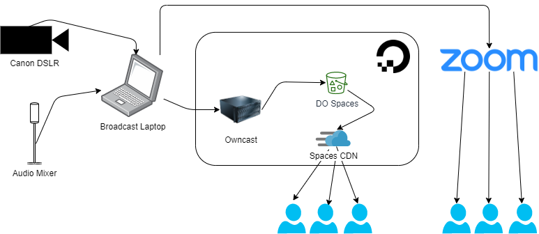
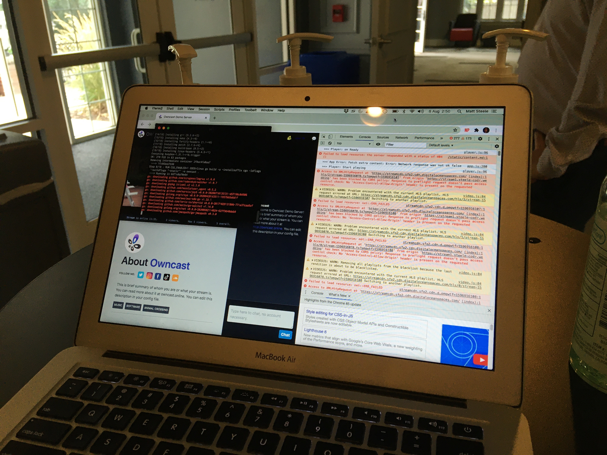

So you've decided you want to livestream your event and [run the server yourself](/indieweb-wedding-livestream) instead of relying on Twitch?
Neat! Here's the recipe I used for my wedding.

This is a single-camera setup, streaming through [OBS][obs] to your server and a Zoom room.

_Photo credit: Justin Duster_

## Hardware

To run the livestream, you'll need:

**Digital camera** - We used a Canon DSLR, connected to a computer via USB. You can also use the HDMI out along with a capture card if your device supports a ["clean" video out](https://1.shortstack.com/r2zfS5).

It needs to be discoverable as a video input in OBS; not all digital cameras are!
Our first attempt was with a 2015-era Canon camcorder, but it wasn't readable as an input source.

**Audio input** - If you have access to a mixer at the event, you can patch into the output and get high-quality from multiple sources.
In our case, we had audio from a few microphones as well as another laptop running the soundtrack.

**Server running Owncast** - I used a DigitalOcean VPS for this.
Setting up Owncast is [documented in its Quickstart](https://github.com/gabek/owncast/blob/master/doc/quickstart.md). I had it running in a Docker container.

**Computer broadcasting via OBS** - Hook up the audio/video sources into [OBS][obs] and broadcast a stream to your Owncast server.

Depending on what else you have going on concurrently (such as simulcasting to Zoom), you may need a relatively powerful workstation for this.
Our first attempt at broadcasting was on my i5 laptop, and it began dropping frames almost immediately! Switching to a gaming laptop resolved the issue.

## Streaming pipeline

Owncast supports serving video files directly from the server, but we ran into constraints both on bandwidth and CPU utilization.
A better approach is to configure Owncast to upload files to an S3-compatible storage and serve them via HTTP.

DigitalOcean's Spaces, an S3-compatible offering, fit the bill. You can follow Owncast's [S3 guidelines](https://github.com/gabek/owncast/blob/master/doc/S3.md) for the storage provider of your choice.

## User Interface

You can simply point folks to the Owncast's web UI. It's got chat integrated and is pretty nice!

I just wanted to emed the video onto our website, so we were responsible for embedding the HLS stream on our website.

You'll need a library to read the HLS playlist (from the Owncast server at `/hls/stream.m3u8`).
We used [videojs](https://videojs.com/) for a nicer "live" UI, but you can also use a native `<video>` element alongside the [hls.js](https://github.com/video-dev/hls.js) library.

## Simulcasting to Zoom

Basically I followed [this guide](https://streamgeeks.us/how-to-connect-zoom-obs/), which configures OBS's output as a "virtual camera" to feed into a Zoom room.

You also have the option to have [Zoom be the "driver" of the stream](https://support.zoom.us/hc/en-us/articles/115001777826-Live-Streaming-Meetings-or-Webinars-Using-a-Custom-Service) to an RTMP server, but that puts an ugly Zoom watermark on the stream.
If you have the bandwidth, it's better to upload via OBS and also have Zoom running.

## Running the stream

We put together a Google doc with the playbook:

**30 minutes before the ceremony:** Launch OBS and configure input sources. Test audio levels, etc.

**10 minutes before:** Begin streaming a "Starting soon" scene to Owncast and Zoom

**5 minutes before the ceremony:** Begin recording the stream in OBS (to save a local copy)

**Start of ceremony** - Switch OBS from "Starting soon" scene to "real" video input

If you're simulcasting to Zoom, I also recommend deputizing someone as co-host, so they can admit viewers, mute noisy folks, etc.

## Stuff I learned along the way

**Test your stream beforehand** - I did a few test streams in the weeks leading up to the event (I streamed some movies with friends), and the tests paid off like crazy.
You don't want to be figuring on your event date what your server's optimal encoding settings are, or whether you need to host your video files via S3.

**Communicate with collaborators** - Ten minutes prior to my wedding starting, I was SSHed into the server, recompiling the Owncast container to switch off CDN file serving.
Why? Because I miscommunicated with my videographer where a "test URL" would be setup, which resulted in an improper OBS configuration. Oops.

**For short events, scaling your server vertically is cheap and easy** - I started with a cheap \$5/month server on DigitalOcean, but increased its CPU and RAM substantially (to their \$160 server) to support transcoding 3 quality levels concurrently.

Since DO bills by the hour, it was still cheap! I only ran the server at this level for a day during testing and the ceremony, so it didn't actually cost more than a couple bucks to run. Way cheaper than spending a ton of time tuning server settings to reach optimum levels.

Thanks again to Justin Duster for helping run the event, so I didn't have to stress out too much on my wedding day!

[obs]: https://obsproject.com/
