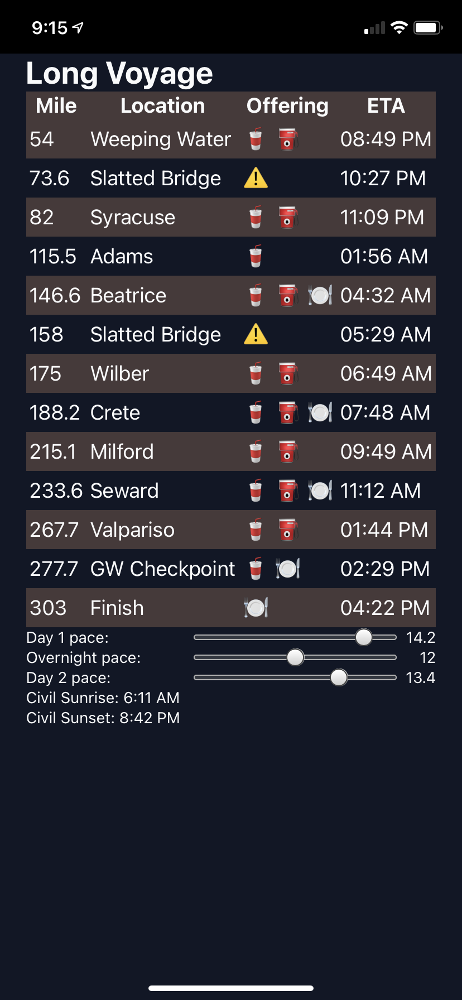

I've been preparing for a [303-mile endurance gravel bike race](https://www.gravel-worlds.com/the-long-voyage). Not by training or improving fitness, of course, but by [building a PWA to estimate and track checkpoint ETAs](https://longvoyage.steele.blue/).

By adjusting the sliders for my day and evening paces, the app estimates when I'll be able to take breaks, reach hazards, etc.



It's been a while since I built something on the front-end that did lots of date manipulation, but I thought this would be a nice time to try out the Temporal API, which is [now in Stage 3](https://tc39.es/proposal-temporal/docs/) and has a [nice polyfill available](https://www.npmjs.com/package/@js-temporal/polyfill).

Here's a few things I've learned:

## It's pretty similar to Java Time API

The existing JavaScript `Date` API sucks. And like many things, Java is the cause of, and solution to it.

The APIs were [originally ported wholesale from the Java 1.1 era](https://maggiepint.com/2017/04/09/fixing-javascript-date-getting-started/), with all the bugs and warts therein. Months in the year are zero-indexed, but days of the month are one-indexed? You better believe it.

Java's date/time APIs sucked badly enough, and longly enough, that most developers switched to userland libraries, in particular [Joda Time](https://www.joda.org/joda-time/). Eventually the lead maintainer of Joda Time was recruited to create a [new standard date and time library](https://jcp.org/aboutJava/communityprocess/pfd/jsr310/JSR-310-guide.html).

Similarly, a thousand Node libraries/flowers have bloomed, all trying to provide a saner operations on dates (including, incidentally, a [port of Joda Time](https://js-joda.github.io/js-joda/)). And [Maggie Johnson-Pint](https://maggiepint.com/), the core maintainer of Moment.js, has been championing the new Temporal API standard.

Having worked with both of these new "standards", I'm pretty impressed at the conceptual convergence! Most of the base classes are available in both libraries: from [ZonedDateTime](https://docs.oracle.com/en/java/javase/11/docs/api/java.base/java/time/ZonedDateTime.html) to [Duration](https://tc39.es/proposal-temporal/docs/#Temporal-Duration), to [Instant](https://docs.oracle.com/en/java/javase/11/docs/api/java.base/java/time/Instant.html). Combined with the polyfill's [nice TypeScript definitions](https://www.npmjs.com/package/@js-temporal/polyfill), it's really straightforward to just start working with the library, and autocomplete your way to development.

It's another example of [why Java folks should feel at home with TypeScript](/typescript-for-javaers).

Seriously, this is really nice to use:

```ts
const dayDelta = startTime.until(nightTime);
const totalHours = dayDelta.total({unit: "hours"})
const nightDelta = nightTime.until(morningTime);
const totalNightHours = nightDelta.total({unit: "hours"});

// how far can you get by sundown?
const dayDistance = totalHours * pace.day1;
if (distance < dayDistance) {
  const hoursDelta = (distance / pace.day1).toPrecision(5);
  const eta = startTime.add(`PT${hoursDelta}H`);
  return eta;
}
```

## It doesn't support parsing human-readable dates?

One feature I was expecting, and which the Java Time API supports, is parsing and formatting "human readable dates", via a [DateTimeFormatter](https://docs.oracle.com/javase/8/docs/api/java/time/format/DateTimeFormatter.html). This doesn't appear to be in scope for Temporal API! From what I can tell, if you've got anything that isn't a flavor ISO8601, you'll need to pull in another date parsing library.

I'd love to be wrong about this, so if you know this API better than me, save me from having to pull in date-fns in the future.

## It does format human-readable dates, using the Intl API

On the formatting side, it took a bit of digging but I was able to convert a `ZonedDateTime` to a human-readable time (think displaying just the `HH:MM`), using the [Intl.DateTimeFormat](https://developer.mozilla.org/en-US/docs/Web/JavaScript/Reference/Global_Objects/Intl/DateTimeFormat) API.

Unlike the Java formatter, which does take a literal `HH:mm` string, this API requires you to pass in an object of the fields you want to display:

```ts
const f = new Intl.DateTimeFormat("en-us", {
  hour: "2-digit",
  minute: "2-digit",
});
const etahhmm = f.format(eta.toInstant().epochMilliseconds);
```

This is a little unorthodox compared to the Java Time APIs, or Moment/date-fns/etc, but once you try it out it's pretty straightforward.

And it's not nearly as painful to use as the [Golang formatter](https://golang.org/src/time/format.go).

Overall the Temporal API has been really pleasant to use. I can't wait to use it as it gets built into browsers and Node, and not have to pull in another third-party Date library again.
