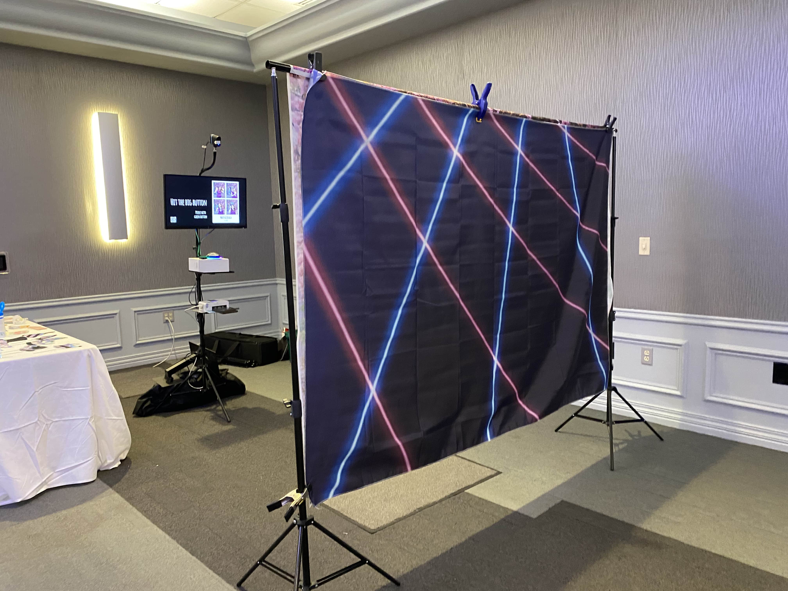
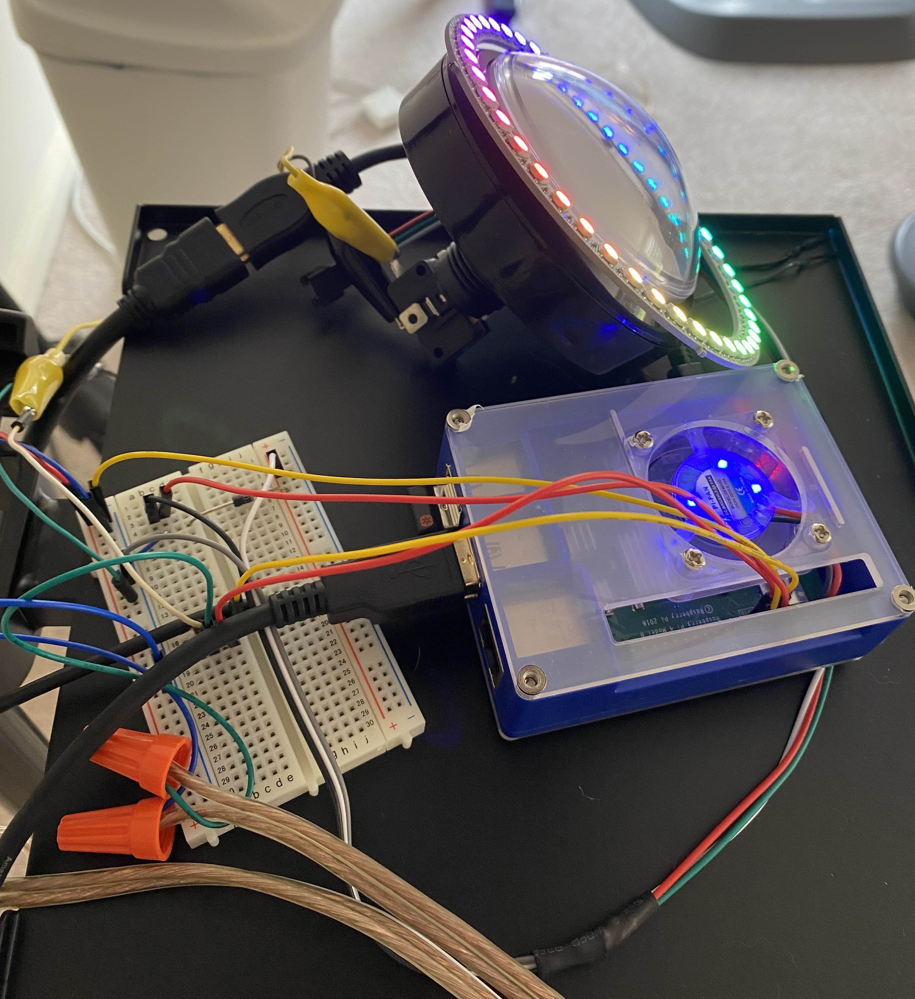
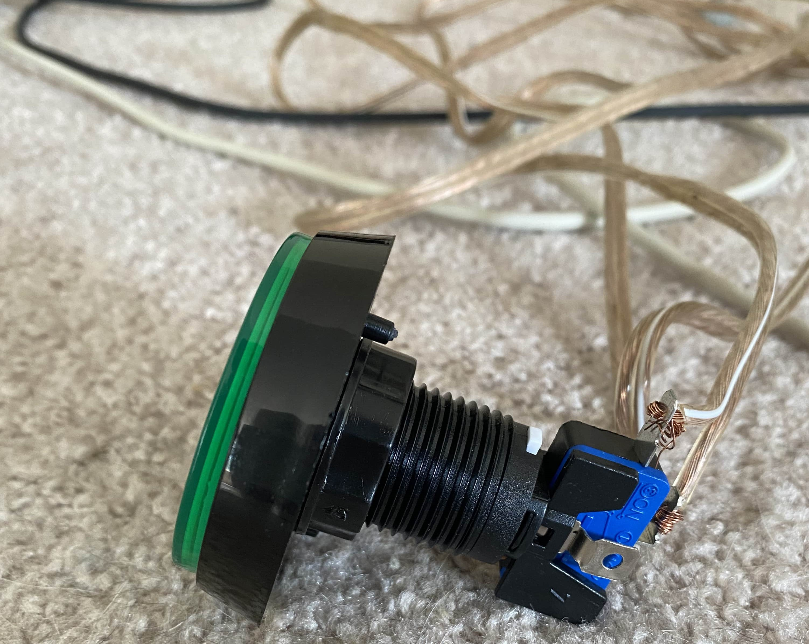
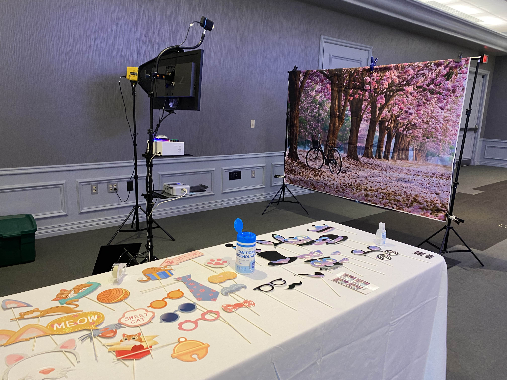
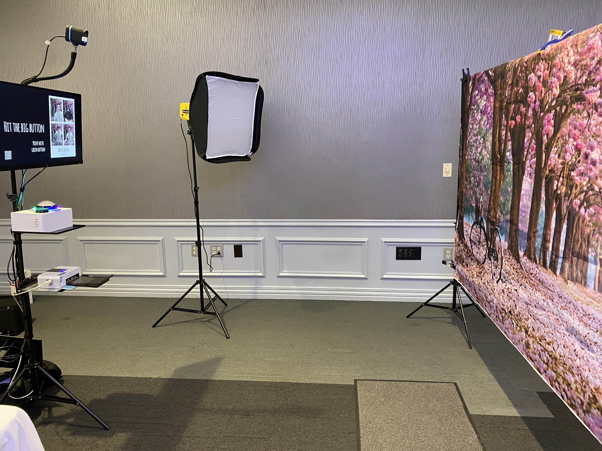
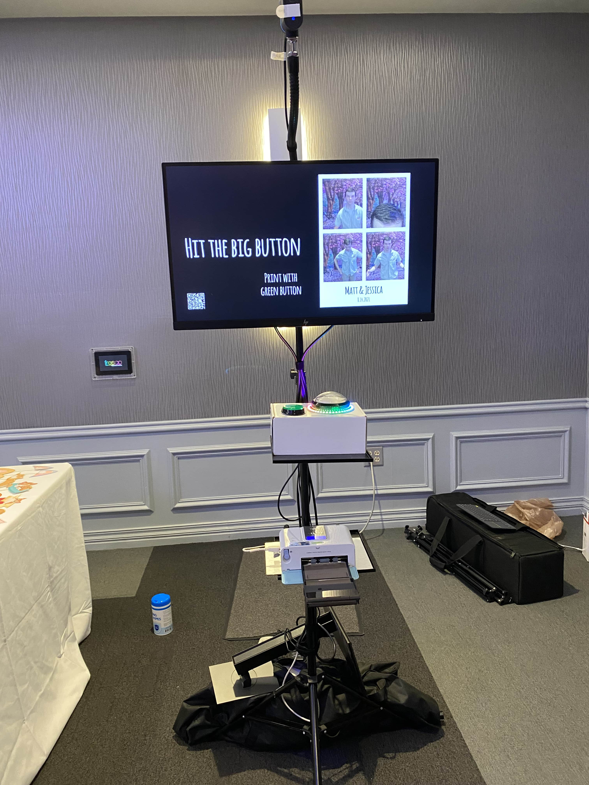
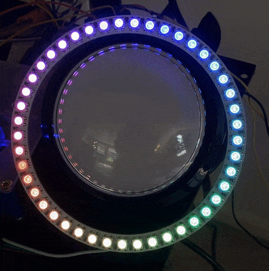
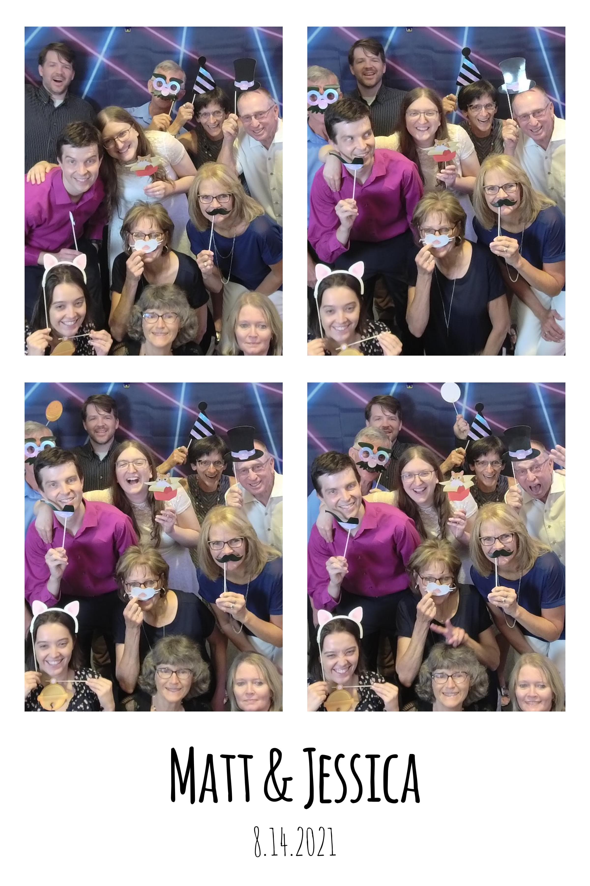

`youtube:https://www.youtube.com/watch?v=tNagjSGzJYA`

I put a homemade photo booth together for a wedding reception we postponed for a year, on account of, *gestures everywhere*:



It was a fun project that let me play with new hardware and software. Here's a few photos of the project, and some of the things I learned.



The guts of the project were driven by a Raspberry Pi 4 running [pibooth](pibooth). It's a great project that works well out of the box, and has a plugin system if you want to anything.


The Pi, wiring, and breadboard and wiring went into a small box, along with a few buttons. The big button started captures, and the small one printed the last photo.



I tried various means of connecting up the buttons; speaker wire worked surprisingly well! But in the end a few small alligator clips and jumper wires were sufficient.



We setup a couple backdrops and had a modeling light to provide standard illumination.
I would have loved to use a greenscreen along with an OBS virtual camera, but the Pi wasn't powerful enough to perform chroma keying in real-time.



Photos were taken using a webcam. Originally I was hoping to use a higher-quality mirrorless camera, but [gphoto2 has issues with Sony cameras](https://github.com/pibooth/pibooth/issues/184).



Printing was done using a small Canon printer, which we had on a stand below the image. I had never used a dye-sublimation printer before, but I was really impressed with it!
The guests were really excited to see [each color get applied sequentially](https://www.youtube.com/watch?v=DA2yJe3o8s0), and took home a postcard-sized souvenier from the night.

We also configured each photo to get uploaded to a shared Google Photos album and had a QR code to let folks view their photos after the event; this was also supported by a few Pibooth plugins.

## Hardware

I wouldn't recommend this as a shopping list; this sort of project works best reusing any pieces you have around your house. 
If you were to source all these parts exclusively for this project, it would be substantially more expensive than using an off-the-shelf photo booth (or renting one).

That said, here's the parts I used:

* Computer: Rasperry Pi 4
* Camera: [Mevo Start](https://mevo.com/pages/mevo-camera)
* Camera attachment: [Flex Arm](https://tethertools.com/product/rock-solid-heavy-duty-superflex-arm/) with tripod adapter
* Display: HP 27" monitor
* Display attachment: [VESA monitor mount](https://tethertools.com/product/studio-vu-monitor-mount/)
* Printer: [Canon Selphy CP510](https://www.usa.canon.com/internet/portal/us/home/products/details/printers/support-inkjet-printer/selphy-series/selphy-cp510/selphy-cp510)
* Modeling light and tripod - [Interfit Honey Badger](https://interfitphoto.com/products/honey-badger-320ws-2-light-kit)
* Buttons: [Adafruit arcade buttons](https://www.adafruit.com/product/1185)
* Ring light: [WS2812B Neopixel clone with 48 LEDs](https://www.aliexpress.com/item/4000761092272.html?spm=a2g0s.9042311.0.0.3e044c4dDgMsfe)

## Software

Most of the software was taken care of by [pibooth](pibooth), with a few additional plugins and customizations.

You can see the configuration and other customizations here: https://github.com/mattdsteele/pibooth-config

The primary mod I built was a custom plugin which provided support for the ring light, using Adafruit's [neopixel Python library](https://learn.adafruit.com/neopixels-on-raspberry-pi/python-usage).
It setup an "attract mode" with a rainbow cycle, as well as a countdown timer and a virtual "flash" while capturing images.



I learned a bit about Python multithreading along the way too!

```python
@pibooth.hookimpl
def state_preview_enter(app):
    app.pixels.fill((0,0,0))
    app.pixels.show()

    proc = threading.Thread(target=countdown, args=[3, app.pixels])
    proc.daemon = True
    proc.start()
    app.neopixels_proc = proc;
```

Along with our [wedding livestreamed with Owncast](/indieweb-wedding-livestream), I had a great time geeking out with my wife. Way more fun than stressing out about caterers and dress fittings.



[pibooth]: https://github.com/pibooth/pibooth