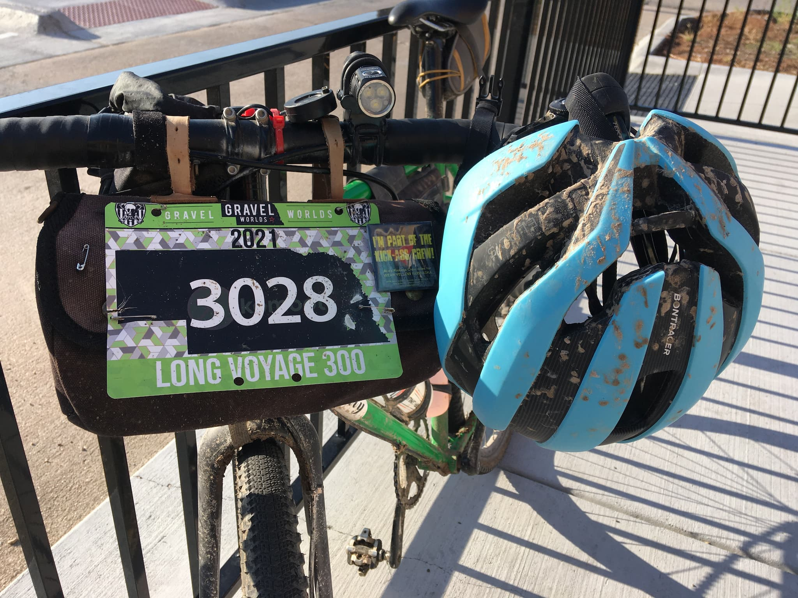
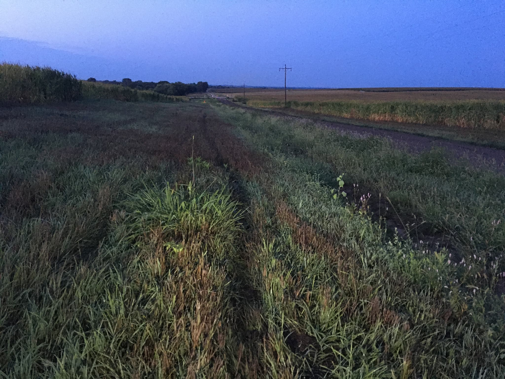
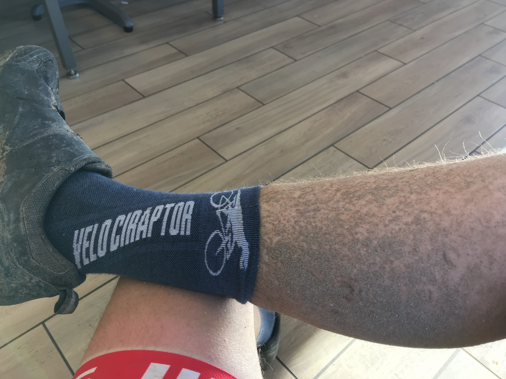

I participated in the inaugural Gravel Worlds [Long Voyage](https://www.gravel-worlds.com/the-long-voyage) bike race last weekend. It was my fifth year racing a Gravel Worlds event, and I'm not planning on stopping any time soon. Corey, Craig, and the other organizers do a great job to make everyone welcome and accepted.

I applied for the 300-mile event partially for personal redemption. In 2018 I raced [Trans Iowa](https://transiowa.blogspot.com/), but only made it about halfway through the 300+ mile course, primarily due to poor equipment and clothing choices. After T.I. ended, I wanted to give it another go, and trusted the Pirate Cycling League to keep the spirit alive.

I pulled up to the starting line having trained with teammates [Rafal](https://www.instagram.com/rdoloto78/) and [Alex](https://www.instagram.com/alexander_g_sanchez/), both of whom are stronger riders and helped pull me through summer Bacon Rides. I also got to chat with multiple other folks who came out for the send-off, including Patrick Davlin, Robbie Benton, Jason Faas, Michelle Cleasby, Curtis Wilson, and Dustin Slivka. Seeing these folks after a year of of isolation and Zwift riding was really heartwarming.

Prior to the race starting I spent most of the previous few days worrying about the weather. The race included 15 miles of dirt/minimum maintenace roads, which can easily become unrideable when wet. The forecast called for thunderstorms the evening of the race, which would have made a long day even longer. As the race started, the weather was beautiful (though humid), so I was excited we had avoided the storms. Turns out, not the case!

As the race began I was feeling good. The race didn't include any intermediate cutoffs, but to finish you had to maintain a 10mph pace, including any stops/breaks. I was riding around 15mph, so I had some time banked. The gravel north of Lincoln is quite sandy, but was quite rideable on my Cannonball 42mm tires.

Around 25 miles in, the skies opened up and it began pouring. Luckily there was no ride-delaying lightning or thunderstorms, those all appeared to be south of us. I just got completely drenched, and ate a bunch of limestone that collected on my water bottles. As the sun began to set, the storms continued to be visible on the horizon through Omaha, and it was quite the experience to see the spider lightning from afar. I hit one section of [MMR](https://flickr.com/photos/nickfaiello/4743812399) which was a little damp but completely rideable, and thought I was in the clear. How wrong I was!

At mile 54 we refuled in Weeping Water, and continued on to the east and south of Lincoln. Remember how I was so excited that the majority of the rain missed us to the south? Apparently I wasn't thinking straight, and was unpleasantly surprised when I started to pick up more mud on the next MMR, though I was able to shed it without too much hassle.

Night riding was pretty pleasant, the weather was great with a nearly full moon helping illuminate the corn and soybeans surrounding me, and cicadas helped to drown out the sound of crunching limestone beneath me.

At mile 90 we hit another mile of MMR which was partially unrideable, though I felt pretty confident just mashing through on my singlespeed as I had fewer parts to fail. I came across one rider with a completely blown deraillieur after attempting to shift while covered in mud, which unfortunately ended her event.

Finally around mile 130 I hit a dirt road that was completely unrideable, and so muddy that it was impossible to even push the bike through; mud would just get caught on the tires and jam up in the fork, seizing up the wheels. The only solution here is to hike-a-bike. I have some experience from years of racing cyclocross, but the optimal strategy of shouldering in the triangle wasn't feasible with frame bags and multiple bottle cages. So I threw the bike over my shoulder, and just tried to slog on. Those two miles of road took nearly an hour to traverse, and sapped a ton of energy I was hoping to preserve for later in the race.

We hit one more dirt road that evening, but we were able to push the bike through a grassy ditch. As dawn broke, I was praying to the gravel gods that sunlight would help dry out the remaining 7 miles of dirt on the course.

While riding overnight I also encountered a new terrain I hadn't seen in years of gravel riding - slatted bridges with gaps wider than my tires; which could easily swallow a wheel. I was probably more cautious than I needed to be when traversing them, but didn't want to take any chances suffering a mechanical because I was in Full Send mode.

As dawn broke I continued to ride with a couple folks from Pennsylvania and Michigan. As the headwinds began to come into effect, we formed a paceline and began to take pulls pretty effectively, considering we hadn't ridden together before. A few of them pulled the plug in Crete, and I rode out to Milford with another singlespeeder from Kansas. We encountered a few dirt roads, but the sunlight and wind dried them out and they were as fast as pavement.

Coming to Milford at mile 215, the math wasn't looking great for making the 11pm deadline, my pace just wasn't high enough to make the cutoff, especially since the final 50 miles would be going through the hilly [Bohemian Alps](https://en.wikipedia.org/wiki/Bohemian_Alps). I wanted to push through more, and rode solo out to Seward, only stopping once to chat with a farmer whose driveway the course accidentally cut through. I think he was more shocked that any cyclists were out in the area, than he was upset we were technically trespassing.

I made it to Seward at mile 234 and decided to pull the plug. I probably had enough gas in the tank to make the next town at mile 267, but exhaustion after 25 hours of riding was beginning to set in, and I was fairly certain I was in the lantern rouge position and wouldn't have anyone checking on me in case something went wrong.

### Things that worked well

* Equipment - I was pretty happy with all the stuff I carried. For night riding, I modded a [Lumintop EDC18](https://budgetlightforum.com/node/69826) flashlight with an elliptical lens, and carried multiple extra 18650 batteries to swap out through the night, this gave me plenty of light and the confidence to keep a reasonable speed. Also bringing a clean change of socks was a huge morale booster.
* Singlespeed gearing - I rode an easier gearing (42x22) than I generally ride gravel (42x19), with the assumption that I'd need the extra teeth as fatigue and hills crept up throughout the day. This was a good choice; I'd have been walking far more hills near the end had I chosen a "faster" cog.
* Route planning - I spent the days prior to the race checking out the Nebraska DOT's [surface type maps](https://dot.nebraska.gov/travel/map-library/county/) to try and gauge where the MMR was on the course. Knowing how much of a break I'd have before the next potential hike-a-bike was a good boost of self-confidence and cleared a potential point of anxiety for me. Additionally, [building a route estimator](https://steele.blue/js-temporal/) helped keep me in tune with how I was progressing based on my moving speeds.

### Things I'd work on improving

* Bike fit - If anything was going to give on this ride it would have been my back and palms, and I think a more precise fitting and adjusting saddle position, etc. would help alleviate these issues.
* Prepping for hike-a-bike - If there's a good chance I'll be shouldering a bike for multiple miles, I'm going to strip off the bottle cages on the bike frame, and wear a Camelback instead. It'll help with proper form, and the hydration pack should provide some padding for the steel frame digging into my shoulder (which is still sore!)
* Applying more sunscreen - I got burned after not applying more sunscreen on the second day of riding, and sunburns traditionally sap a ton of energy from me.
* Less stopped time - At each town I stopped at convenience stores anywhere from 15 to 50 minutes; this obviously eats into my elapsed pace, and is probably the lowest-hanging fruit.
* General fitness - Near the end of my ride I was in dead last place of those still riding. For races with a cutoff, that's not good enough. Some structured training, sweet-spot intervals, and the like are the standard solutions here.

Overall I was pretty happy with my race; I set new personal records for the longest and farthest I've ridden in one go, it was my first completely overnight ride, and I made some new friends along the way. But I'd love to finish one of these endurance races, so I have a 2022 goal already in mind.