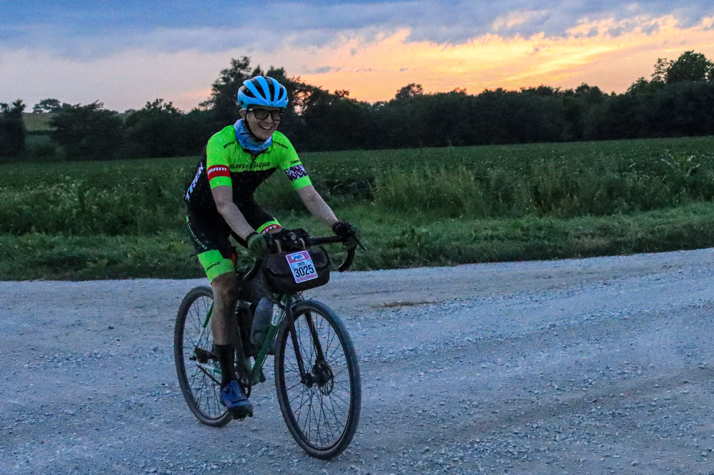
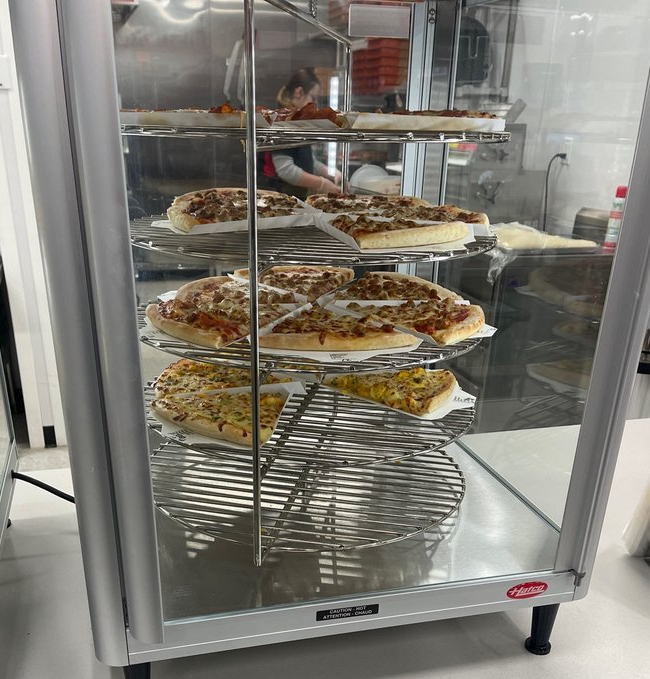
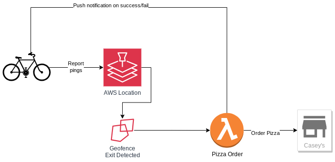
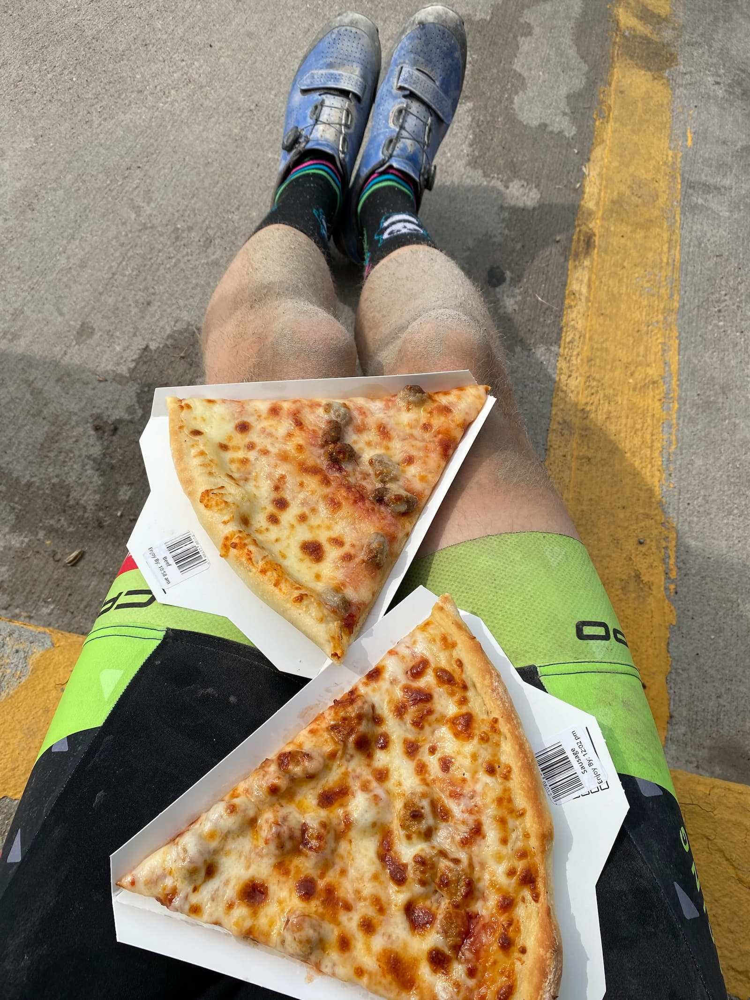

As harvest season begins here in the Midwest, I once again celebrate by grinding Nebraska gravel at the [Gravel Worlds Long Voyage](https://www.gravel-worlds.com/the-long-voyage) bike race.
As in previous years ([2021](/gravel-worlds)) ([2022](/serverless-bike-gps)), I spent more time writing code for a marginally-useful project than I did training. But hey, I finished!

## Fueled by Pizza

My goal this year involved optimizing my food choices during the race: pizza from [Casey's General Store](https://www.caseys.com/).
These convenience stores are S-Tier options when out in the middle of nowhere.
In addition to snacks and drinks, most Casey's have a kitchen, and have pretty decent grab 'n go slices of pizza.

My problem: last year, there were so many faster riders ahead of me, that **all the pizza was taken by the time I made it to the stops.** This is an outrage!

This year, I knew I had to do better. But with time winding down on improving my fitness, I had to resort to the latent superpower of software hackery.
My thought: **why not have a fresh pizza ordered ahead of time, scheduled precisely for when I arrived?**

More precisely, I could write a script that ordered a pizza for me, GPS-triggered by my bike leaving a geofence about an hour from the stop. Building this [on top of the serverless GPS tracker I made last year](/serverless-bike-gps) should fit into the architecture pretty well.

## Casey's Pizza API When

The overall design: I setup a geofence within the AWS Location service, which was monitoring my GPS tracker.
When my tracker exited the geofence, it would trigger a Lambda function that calculates an ETA for my next stop, and orders the pizza.

The problem: Casey's doesn't have a public API for online ordering.
So I had to resort to alternate approaches. More specifically, I fell back to **screen scraping the website**, everyone's favorite hack.
I've had to screen-scrape for other projects (such as [updating privacy on Strava activities](/secret-strava)), but since Casey's website was a complex React app that rendered everything on the client, I had to use a more powerful scraper; this time powered by [Playwright](https://playwright.dev/).

Getting Playwright to run in a Lambda was An Experience. Full writeup [here](/playwright-on-lambda).

To keep track of the status, I also setup a push notification to be delivered to my phone (and watch) on a success or failure. Configuring Web Push to work on iOS devices is probably worthy of its own post.

## Pizza False Positive

I had the triggering geofence configured around mile 180 of the race, with the pizza setup to be delivered at mile 200.

As I left the geofence, I got a push notification on my watch saying that the pizza had been successfully ordered.

But when I made it to the stop, **there was nothing at the counter, and they had no record of an order**. And sure enough, I checked my account, and no order had been placed.
**False positive.**

There were a few pre-made slices available, so I picked those up. They left a bitter taste in my mouth, not just because they weren't especially fresh. Through the rest of the 300-mile race, all I could think about was what might have went wrong with my function.

After finishing the race, I made it to a computer and quickly checked the logs to see what had gone wrong. But to my chagrin, there was nothing in the logs indicating what caused the failure; it was just a silent success. I had nothing to go on to try and debug.

A few days later, I enhanced the Lambda to capture a video of the browser in action and upload it to an S3 bucket for analysis. Running a test of the updated behavior, **it finally worked**. I picked up a fresh Hawaiian pizza, and we enjoyed the pie from the comfort of our home.

I'm still not entirely sure why it worked. My going theory is that the Lambda had terminated processing as soon as the final `form.submit()` went through in the embedded Playwright browser. It's quite possible that the online ordering website saw that the browser never received a Success response, and didn't fully process the order.
My guess is that the additional time spent processing and uploading the video gave the browser sufficient time to clean up properly, with serendipity in timing.

## Pizza Lessons

While I was bummed the pizza ordering functionality didn't run, I think it's in a good spot to try again in upcoming races.
I also learned a lot while building this out:

* Consistently screen-scraping a React client-side app with a browser running in the cloud: possible, but boy howdy is it finicky. If I were to redo project, I may opt for reverse engineering one of their native apps, focusing on triggering their APIs directly
* Having a good workflow to simulate geospatial behavior is necessary. At first, I setup a geofence around my house for testing, but having to leave for a walk at 11pm gets pretty old, pretty fast
* That said, don't skimp on real-world testing. Prior to the race, I was mostly testing the function by running it on my local workstation, not in a Lambda. The successes of the local functions gave me false confidence that everything was working as expected
* If you're worried about running out of Casey's pizza during a gravel race, another option is to just let the groups ahead of you get more than 30 minutes ahead, so they have plenty of time to make more slices

The code is available on GitHub: https://github.com/mattdsteele/spot-tracker-tracker/tree/main/pizza-function 
