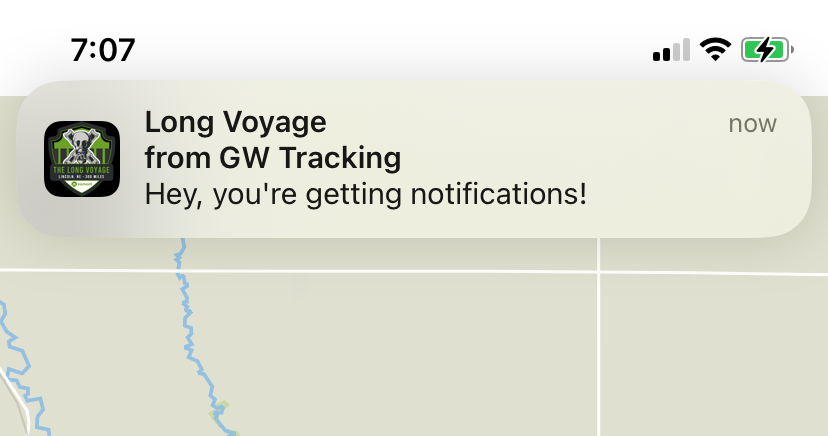
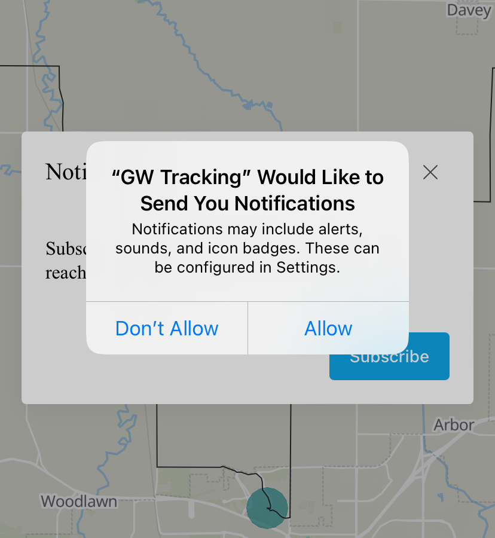
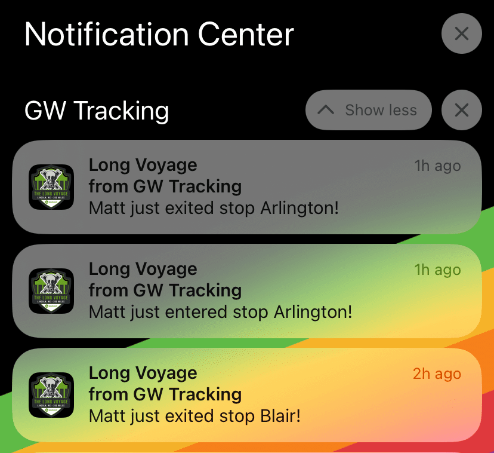
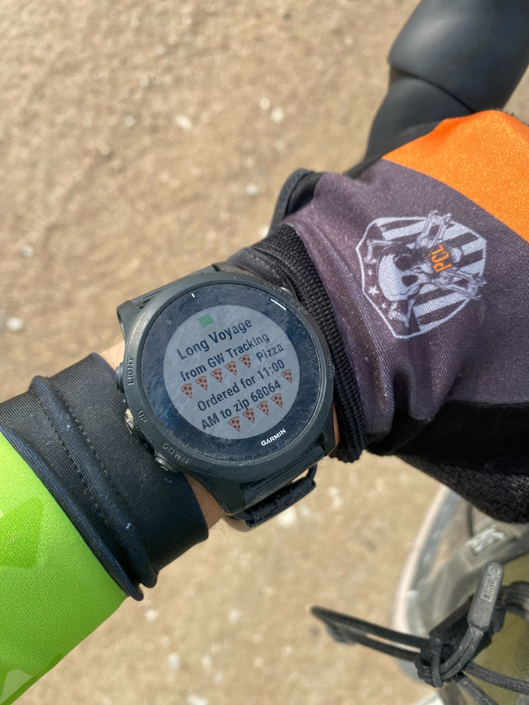

Apple got a lot of positive sentiment earlier this year when they launched betas of iOS 16.4 and announced support for Web Push, along with other features.
[At WWDC they declared](https://developer.apple.com/videos/play/wwdc2022/10098/?time=869)  "As long as you've coded to the standards and use feature detection, so you don't unwittingly exclude Safari, your users will already get the benefit of Web Push".

Having attempted to implement Web Push in a recent project I can attest that the reality was pretty different.
In addition to a number of buggy and inconsistent runtime errors, there were several user-hostile limitations that effectively excluded it from being used by anyone but the most dedicated users.

As iOS 17 rolls out, we're seeing forward progress.
Several of the restrictions have been removed, and the behavior appears to be more consistent, with APIs that can be feature-detected as one would expect.

## No longer requires Feature Flags/Experimental Features

The big issue I encountered when trying to support Web Push was that the APIs were disabled by default in iOS 16.
It was an "available" option, but tucked behind the Settings -> Safari -> Advanced -> Experimental Features setting, alongside dozens of other toggles.
Functionally this killed Web Push's adoption, as you couldn't reasonably expect a general audience to modify their feature flags to support this.

The good news is that as of iOS 17, this is no longer required, and the relevant APIs have been enabled by default.
There is still an option for "Notifications" in the (now renamed) Feature Flags list, but it doesn't seem to be required to enable support.

## Add To Homescreen still required, still not promoted



Another user-facing limitation: only webapps which have been added to (and launched from) the Home Screen have all the APIs needed to enable Web Push.
This is clearly an intentional decision by Apple to prevent abuse of a powerful feature, but it also has a similarly limiting effect of the usability of the feature.

As [Maximiliano Firtman notes](https://tinyletter.com/firt/letters/webpush-for-ios-chatgpt-for-web-devs-apple-vision-pro-updates-to-chrome-and-more):

> Users will never know that adding that web app to the home screen will give it more power. Apple doesn't support app banners, an installation API, or a menu term change (such as "Install"), maintaining a classic Apple decision to hide PWAs from the user while still technically available. 

This requirement still exists. Given my anecdotal observation that I've never seen a non-developer iOS users add a website to their home screen, it'll take pretty dedicated in-app tutorials to guide users.

## You can now (mostly) feature-detect support

One big hassle with Web Push on iOS 16 was that APIs would be available, but weren't effectively implemented when the limitations above were in place.
So if you were trying to check for the existence of particular APIs before working with them, you'd only see errors at runtime for an app that wasn't added to the home screen, for example.

Luckily, this appears to have been cleared up. These combinations of checks should be sufficient:

```javascript
// Service Workers supported
if (!'serviceWorker' in navigator) {
  return;
}

// Web Push supported
const registration = await navigator.serviceWorker.ready;
if (!'pushManager' in registration) {
  return;
}
```

A site with an installed Service Worker which is installed on the home screen will consistently pass these checks.
Sites which are running in "standard" Safari won't pass the second check, and you can bail.

If you're looking to give users some guidance that the feature is available, you'll need to add some additional checks in your code; as `navigator.serviceWorker` will exist, but not `registration.pushManager`.
But, since other browsers support Service Workers and not Web Push, I wasn't able to find a clean way to feature detect this, and resorted to browser sniffing, so I could show the help context.

## It's workable, for some definition of workable



Ultimately I ended up using this for my [gravel bike tracking website](/geofence-pizza-ordering/), in order to send updates to folks watching at home as I made it to each stop, which I had bounded with a geofence.
I also setup a push notification to go to my phone when it "successfully" ordered a pizza. And while the push notification made it to my phone, the pizza did not ultimately get ordered.

So maybe there's the lesson: with enough dedication and grit, you can get push notifications to show up on iOS devices, and it's a little easier with iOS 17.
And depending on what you're trying to integrate with, it may not even be the most brittle link in the chain anymore.

